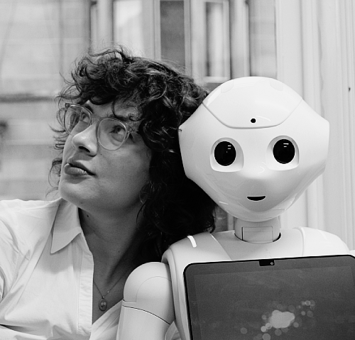

{width="389"}

I am a PhD student in Human-Robot Interaction at the [Social AI CDT](https://socialcdt.org/), based at the [University of Glasgow](https://www.gla.ac.uk/pgrs/amelievoges/). My research examines what makes human–robot interactions successful in both the short and long term. I am particularly interested in how user customisation can strengthen relationships with social robots and support their meaningful integration into everyday life.

I am supervised by [Dr. Mary Ellen Foster](https://www.maryellenfoster.uk/) at the University of Glasgow and [Prof. Emily S. Cross](https://gess.ethz.ch/en/the-department/people/person-detail.MzE2ODc2.TGlzdC81MTIsNjE4MTIwODY=.html) at ETH Zürich.

You can contact me via [email](mailto:a.voges.1@research.gla.ac.uk), and find me on [LinkedIn](www.linkedin.com/in/amelie-voges-9b9bb1329), [Twitter](x.com/amelielvoges), or [BlueSky](bsky.app/profile/amelievoges.bsky.social).
